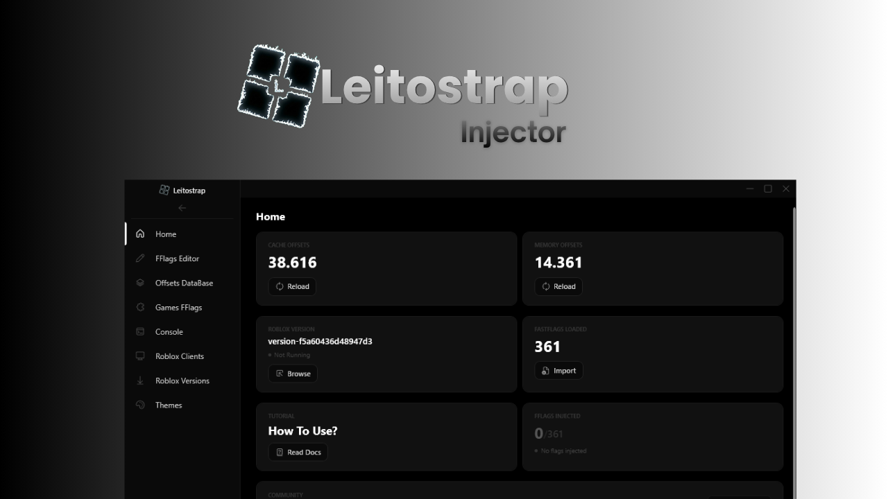

  
  <h1>Leitostrap Injector</h1>
  
<i>The most advanced Roblox FastFlags injector — built in C# with live memory injection, 95+ themes, and full customization. Open-Source.</i>

  <a href="https://leitostrap.netlify.app/">Website</a> · 
  <a href="https://github.com/Leitostrap/Leitostrap-Injector/releases/latest">Latest Release</a> · 
  <a href="https://discord.gg/Ga2nGGPgJk">Discord</a> · 
  <a href="https://github.com/Leitostrap/Leitostrap-Injector">Source Code</a>

    

  
  
  

   

  <i>Leave a star if you like the project! ⭐</i>

---

---

## Features

### Injection Engine
- **4 Injection Methods** — Combined Cache+Memory, Cache Method, Memory Offsets (Theo's database), and Memory Offsetless (pattern scan)
- **Safe Memory Write** — Uses NtWriteVirtualMemory via ntdll.dll. No VirtualProtectEx, no NtFlushInstructionCache (avoids Hyperion/Byfron detection)
- **Auto Apply** — Automatically injects FFlags when Roblox is detected. Toggle ON/OFF from Settings
- **Smart Mode** — Intelligent auto-injection that detects the right moment to inject flags
- **Re-apply** — Configurable interval (ms) to re-inject flags. Shows toast notification on each re-apply
- **Roblox Clients** — Live monitoring of all Roblox instances. Shows avatar, username, PID, game, uptime. Kill and inject per instance
- **Cache Method** — Modifies Roblox client settings via proxy/cache files
- **Memory Offsets** — Uses offset database for direct memory writes
- **Memory Offsetless** — FNV-1a hashmap scan, no offset database needed
- **Live Offsets** — Auto-downloads fresh offsets from offsets.imtheo.lol. Always up-to-date
- **HWID Spoofer** — Built-in hardware ID spoofer in Settings

### FFlag Editor
- Full editor with tabs (F1, F2, F3...), search/filter, import/export
- Bulk delete selected or all flags with dedicated icons
- JSON import/export for sharing configurations
- Offsets database browser and profile manager
- Disk-persisted Explorer (Library, FFlags, Auto Apply folders in AppData)
- Community FFlags — Pre-built community flag configurations

### Themes Engine
- **60 Static Themes** — Pure black/white color schemes with unique accent colors
- **35 Animated Themes** — Each with its own unique canvas animation (Matrix Rain, Aurora, Lava, Nebula, Snowfall, Vortex, Fireflies, Glitch, and more)
- **Custom Background** — Upload any PNG, JPG, or GIF as background (stored as Base64)
- **Full Propagation** — Theme applies across all UI elements

### Extras & Tools
- **Discord Rich Presence** — Live section tracking, active flag count, Discord & GitHub links
- **Hide UI / Overlay Mode** — Configurable hotkey (default: Insert) to hide/show window
- **UI Sounds** — Click and success audio feedback (toggleable)
- **20 Languages** — Full localization for English, Spanish, French, German, Portuguese, Italian, Japanese, Korean, Arabic, Russian, Turkish, Polish, Dutch, Swedish, Thai, Indonesian, Ukrainian, Vietnamese, Chinese (Simplified & Traditional)
- **Default Profiles** — Pre-built profiles across multiple categories
- **Versions Manager** — Detects all installed launchers with logos. Launch/Install buttons
- **Console** — Full activity log with injection events, errors, and status updates
- **Proxy Support** — Built-in proxy with certificate management

---

## Why False Positives?

Leitostrap uses Windows Native API (`ntdll.dll`) to read and write process memory. These are the same APIs used by legitimate tools like Cheat Engine, x64dbg, and Process Hacker.

**Why it gets flagged:**
1. **Memory manipulation APIs** — `NtReadVirtualMemory` and `NtWriteVirtualMemory` are also used by malware
2. **Unsigned executable** — Without code signing, SmartScreen and antivirus heuristics may flag it

**There is NO malware, NO backdoor, NO data collection.** This is a 100% false positive common to all memory-editing software.

**Fix:** Add `Leitostrap.exe` to your antivirus exclusions.

---

## How to Use

1. Download the latest release from [Releases](https://github.com/Leitostrap/Leitostrap/releases/latest)
2. Add `Leitostrap.exe` to your antivirus exclusions
3. Run `Leitostrap.exe`
4. Configure your FFlags in the editor
5. Open Roblox and wait for the green status dot
6. Click **Apply FastFlags** to inject

---

## Team

| Role | Name |
|------|------|
| **Developer** | Lean |
| **Developer** | Winnie |
| **Developer** | Prezone |
| **Developer** | Pepper |
| **Developer** | Dem |
| **Developer** | Sword |

### Special Thanks
- **Theo** (Offsets)

---

## Links

- [Website](https://leitostrap.netlify.app/)
- [Discord Server](https://discord.gg/Ga2nGGPgJk)
- [GitHub Repository](https://github.com/Leitostrap/Leitostrap)
- [Latest Release](https://github.com/Leitostrap/Leitostrap/releases/latest)
- [Offsets Source](https://offsets.imtheo.lol/fflags.hpp)

---

  Made with care by the Leitostrap team.

